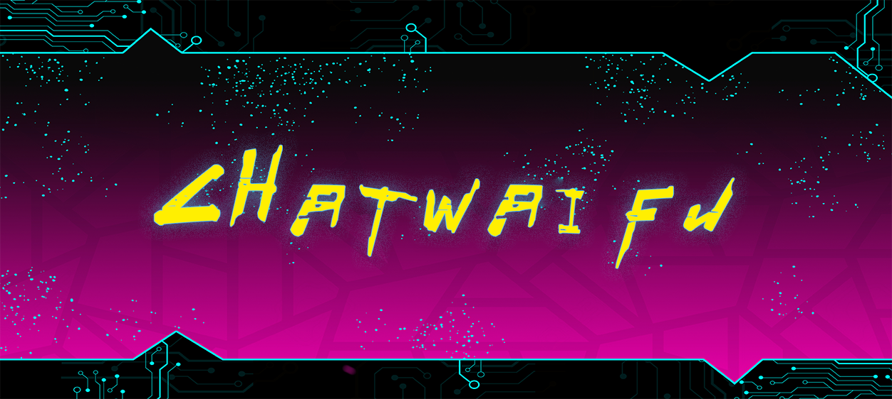
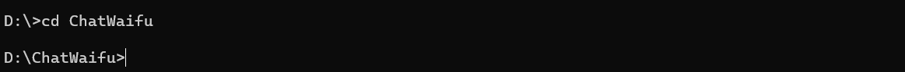
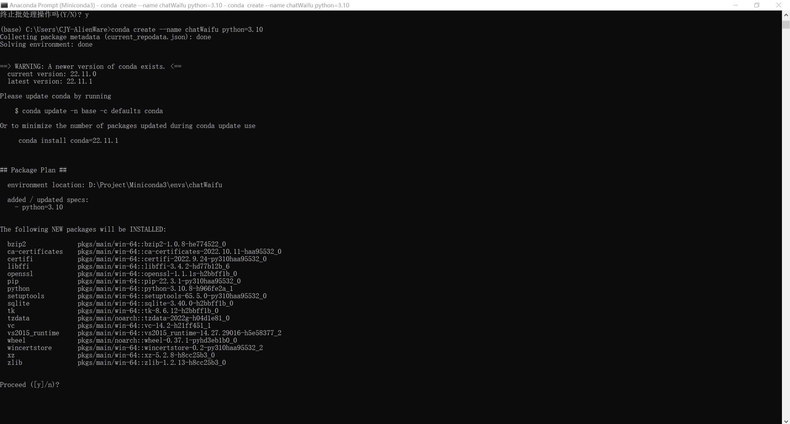
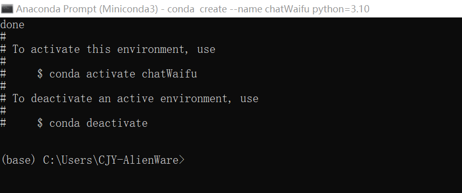
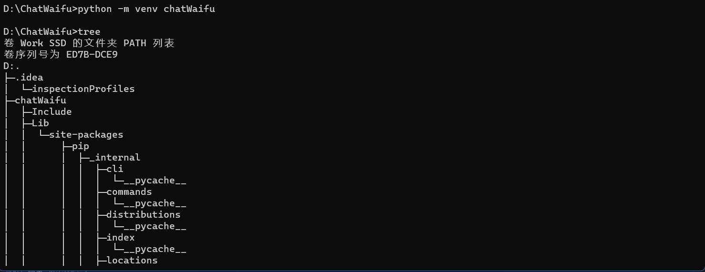
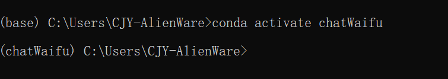
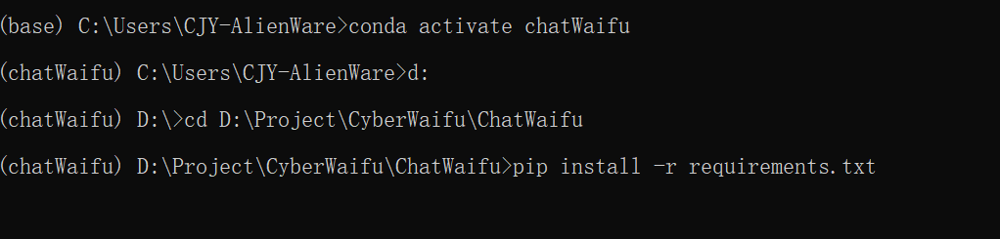

	
	
  	

[中文](README.md "中文") [English](eng-README.md "English") [日本語](jp-README.md "日本語")

> ### 这是一个基于TTS+VITS的ChatGPT语音对话程序!

效果演示BiliBIli:[《青春猪头少年不会梦见赛博女友》](https://www.bilibili.com/video/BV1rv4y1Q7eT "BiliBili")

**当前支持功能：**
* [x] ChatGPT的对话聊天
* [x] 回答转语音
* [x] 多角色语音
* [x] 语音识别对话 (研发了一款真正人性化的智能语音Q宝
* [x] [对接Marai机器人](https://github.com/MuBai-He/ChatWaifu-marai)

**预计支持功能：**
* [ ] 对接Live2D的Web版本

# 目录
* [1.安装环境：](#1.)
	* 1.1 [使用cd命令进入项目文件夹](#cd)
	* 1.2 [创建Python虚拟环境:](#99)
	* 1.3 [进入创建好的虚拟环境:](#venv)
	* 1.4 [pip安装项目所需要的库文件:](#pip)
* [2.导入模型到根目录model文件夹（如果没有自行创建):](#.model)
	* 2.1 [双击导入model](#cd1)
* [3.运行（快和我的老婆们对话吧:](#22)
	* 3.1 [获取ChatGPT Token](#333)
	* 3.2 [开始和CyberWaifu聊天](#444)
* [4.鸣谢](#915)
## 1.安装环境：
> **安装anaconda环境或Python>=3.7**
> 
> **本例使用的环境名称是：chatWaifu**

### 1.1 使用cd命令进入项目文件夹
`cd 你的项目路径`

### 1.2 创建Python虚拟环境:

Conda:`conda create --name CyberWaifu python=3.10`

Python:`python -m venv chatWaifu`

### 1.3 进入创建好的虚拟环境:
Conda:`conda activate chatWaifu`

Python:`.\chatWaifu\Scripts\activate.bat`

### 1.4 pip安装项目所需要的库文件:
`pip install -r requirement.txt`

## 2.导入模型到根目录model文件夹:
Google Drive:https://drive.google.com/file/d/1tMCafhnUoL7FbevVQ44VQi-WznDjt23_/view?usp=sharing

阿里云盘: https://www.aliyundrive.com/s/9JEj1mp1ZRv 提取码: m2y3

### 2.1移动到项目根目录下双击导入model

## 3.运行（快和老婆们对话吧:

日语版：`python ChatWaifuJP.py`

中文版：`python ChatWaifuCN.py`

日语语音对话版（使用中文）：`python ChatWaifuJPVoice.py`

中文语音对话版（使用中文）：`python ChatWaifuCNVoice.py`

中文语音对话版（使用英文）：`python ChatWaifuCNVoiceEN.py`

日语语音对话版（使用日文）：`python ChatWaifuJPVoiceJP.py`

### 3.1 获取ChatGPT Token
#### 在浏览器登入https://chat.openai.com
#### 按F12进入开发控制台
#### 找到 应用程序 -> cookie -> __Secure-next-auth.session-token
#### 将值复制进入终端并回车

### 3.2 开始和CyberWaifu聊天！！！

当控制台提示"You:"时开始说话，说完并出现句子录音结束并发送到ChatGPT对话。

## 4.鸣谢：
- [MoeGoe_GUI]https://github.com/CjangCjengh/MoeGoe_GUI
- [Pretrained models]https://github.com/CjangCjengh/TTSModels
- [PyChatGPT]https://github.com/terry3041/pyChatGPT
